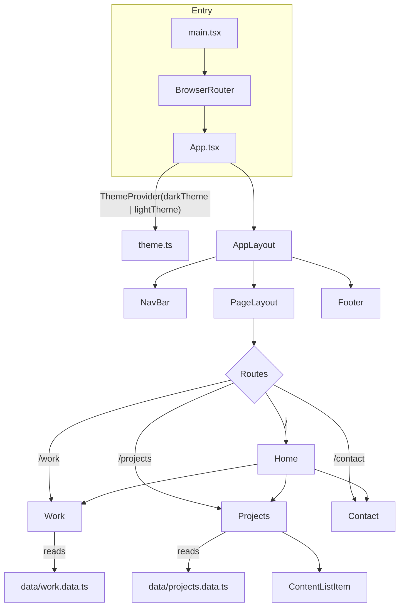

# Architecture

Technical documentation for the `dev-portfolio` codebase. Written for
future-me, reading this cold after months away.

## 1. Overview

This is a personal developer portfolio site — a single-page application
that acts as an online CV. It shows a short bio, work history, a list of
side projects (linking out to their GitHub repos), and contact links
(GitHub, LinkedIn, email).

- **Who it's for**: me — it's shown to recruiters/hiring managers/anyone
  who wants a quick read on my background, and it doubles as a live
  demonstration of frontend ability (see the "Portfolio Website" entry in
  `src/data/projects.data.ts`, which literally says this).
- **Current state**: stable. It's deployed and live at
  [chadrak.dev](https://chadrak.dev). Content (jobs, projects) gets
  updated periodically by editing the data files directly — see
  [Common tasks](../operational/OPERATIONS.md#4-common-tasks).
- **Scope**: intentionally small — 4 routes, no backend, no database, no
  auth. Content is hardcoded TypeScript, not fetched from anywhere.

## 2. Tech stack

| Tool | Version | Why |
| --- | --- | --- |
| **React** | 19 | UI library. Also the framework I want the site itself to demonstrate proficiency in. |
| **TypeScript** | ~5.7 | Type safety across components, data, and props — explicitly called out as a goal in the project's own "Portfolio Website" project description. |
| **Vite** | ^6 | Dev server + build tool. Modern default over CRA (which is deprecated); fast HMR, minimal config. |
| **React Router (`react-router-dom`)** | ^7 | Client-side routing for the 4 pages (Home, Work, Projects, Contact). Handles both internal routes and, via its built-in absolute-URL detection, the external links (GitHub, LinkedIn, `mailto:`) rendered through the same `<Link>` component. |
| **MUI (`@mui/material`, `@mui/icons-material`)** | ^6 | Component library + theming system. Used for its `styled()` API, `ThemeProvider`/dark-light theming, `CssBaseline`, and icon set — avoids hand-rolling a design system from scratch. |
| **Emotion (`@emotion/react`, `@emotion/styled`)** | ^11 | MUI's styling engine under the hood; used directly for the custom `styled()` components in `src/components/styled/`. |
| **Fontsource (`@fontsource/roboto`)** | ^5 | Self-hosts the Roboto font (MUI's default typeface) instead of pulling from Google Fonts at runtime — avoids an external network dependency. |
| **ESLint 9 (flat config) + typescript-eslint** | ^9 / ^8 | Linting, including type-aware rules and React-specific rules (`eslint-plugin-react`, `eslint-plugin-react-hooks`). |
| **Prettier** | ^3 | Formatting, decoupled from ESLint via `eslint-config-prettier` so the two don't fight over style rules. |

No state management library (Redux, Zustand, etc.), no CSS framework
(Tailwind, etc.), no data-fetching library — none of these are needed at
this scale. No test runner is currently installed (see
[Known limitations](#6-known-limitations--things-id-do-differently)).

## 3. Architecture

### Folder layout

```
src/
├── App.tsx                  # Root: theme state, routing, document title
├── main.tsx                 # Entry point: mounts <App> inside <BrowserRouter>
├── theme.ts                 # MUI dark/light theme definitions + custom palette tokens
├── vite-env.d.ts            # Vite's ambient type declarations
│
├── components/
│   ├── layouts/
│   │   ├── AppLayout.tsx    # Outermost width-constrained wrapper
│   │   └── PageLayout.tsx   # Page-level padding wrapper
│   ├── navigation/
│   │   └── NavBar.tsx       # Sticky top nav + theme toggle
│   ├── footer/
│   │   └── Footer.tsx       # Copyright line
│   ├── content/
│   │   ├── ContentList.tsx      # Generic list wrapper
│   │   └── ContentListItem.tsx  # Single project card (title/description/link)
│   ├── pages/
│   │   ├── Home.tsx         # Composes bio + Work + Projects + Contact
│   │   ├── Work.tsx         # Work history (full or preview via `displayCount`)
│   │   ├── Projects.tsx     # Project list (full or preview via `displayCount`)
│   │   └── Contact.tsx      # Social + email links
│   └── styled/
│       ├── StyledContainers.ts  # Layout primitives (ContentSection, PageSection, AnimatedContainer, TagList...)
│       ├── StyledText.ts        # Typography primitives (Heading, Subhead, Text)
│       ├── StyledLinks.ts       # react-router Link-based primitives (LinkIcon, LinkText, LinkNavText, LinkWrapper)
│       ├── StyledIcons.ts       # Icon wrappers (LightMode, DarkMode, GitHub, LinkedIn)
│       └── Animations.ts        # fadeInAnimation keyframes
│
├── data/
│   ├── work.data.ts         # Work history content (array of WorkHistory)
│   └── projects.data.ts     # Project list content (array of ProjectHistory)
│
└── types/
    ├── common.ts             # Shared prop-shape types (WithChildren, DisplayCountProps)
    ├── workHistory.ts        # WorkHistory type (discriminated union, see below)
    └── projectHistory.ts     # ProjectHistory type
```

### Key modules

- **`App.tsx`** is the composition root. It owns the one piece of
  meaningful app state (`isDarkMode`), wires up `ThemeProvider` +
  `CssBaseline`, defines the `<Routes>` table, and sets `document.title`
  per route via a `useEffect` keyed on `location.pathname`.
- **`theme.ts`** defines two MUI themes (`darkTheme`/`lightTheme`) built
  from `createTheme`. The MUI `Palette` type is augmented (via TS module
  augmentation) with three custom tokens — `navBackground`, `strongText`,
  `surfaceHover`, `hoverOverlay` — so mode-dependent colors are defined
  once here instead of being re-derived with `theme.palette.mode ===
  "dark" ? ... : ...` ternaries scattered through component files.
- **`components/styled/`** is a small internal design system: MUI
  `styled()` wrappers around `Typography`, `Box`, `Link` (from
  react-router), and icon components, each taking boolean "modifier"
  props (`hasPadding`, `hasBorder`, `isBold`, etc.) instead of using the
  `sx` prop inline. Every page composes UI out of these primitives rather
  than styling ad hoc.
- **`data/*.ts`** is the actual content of the site — not fetched, just
  imported as TypeScript modules. Updating the site's content means
  editing these files and redeploying.

### Data flow

There's no client-server data flow — it's all static, in-memory,
build-time content:



### State management

- **Theme (dark/light)**: a single `useState<boolean>` in `App.tsx`,
  passed down one level as a prop (`isDarkMode`, `onToggleTheme`) to
  `NavBar`. Not persisted — see [limitations](#6-known-limitations--things-id-do-differently).
- **Everything else is derived, not stateful**: `location.pathname` comes
  from `react-router-dom`'s `useLocation`; page content comes straight
  from the imported data arrays; there's no global store, no context
  beyond what MUI's `ThemeProvider` provides internally.

## 4. Key features

| Feature (user-facing) | Where it lives |
| --- | --- |
| Light/dark theme toggle (nav bar icon) | `App.tsx` (state), `theme.ts` (palettes), `components/navigation/NavBar.tsx` (button) |
| Sticky, translucent nav bar | `components/navigation/NavBar.tsx`, `NavContainer` in `StyledContainers.ts` |
| Home page: bio + preview of most recent job + 2 project previews + contact block | `components/pages/Home.tsx` (composes `Work`, `Projects`, `Contact` with `displayCount` props) |
| Full work history page (all roles, tech tags, responsibilities) | `components/pages/Work.tsx` + `data/work.data.ts` + `types/workHistory.ts` |
| Full projects page (linking out to GitHub repos) | `components/pages/Projects.tsx` + `data/projects.data.ts` + `components/content/ContentListItem.tsx` |
| Contact page (GitHub, LinkedIn, email) | `components/pages/Contact.tsx` |
| Per-page fade-in animation on navigation | `AnimatedContainer` + `fadeInAnimation` in `components/styled/`, applied per-route in `App.tsx` and once around the whole tree in `Home.tsx` |
| Per-route document title (`Work \| Chadrak H`, etc.) | `parsePath` + `useEffect` in `App.tsx` |
| Responsive layout (narrower max-width on small screens) | `AppContainer` in `StyledContainers.ts` (`theme.breakpoints.down("sm")`) |

## 5. Design decisions & trade-offs

- **No backend, no CMS.** Content is hardcoded TypeScript data files.
  Deliberate — this site changes maybe a few times a year (new job, new
  project), so a CMS or API would be pure overhead. Trade-off: updating
  content means a code change + redeploy, not a form submission.
- **No global state library.** The only real app state is one boolean
  (dark mode). Prop-drilling one level and letting MUI's `ThemeProvider`
  handle the rest via context is simpler than introducing Redux/Zustand
  for a single flag.
- **`styled()` over the `sx` prop.** Nearly every visual primitive
  (`Heading`, `Text`, `ContentSection`, `LinkText`, etc.) is a named,
  reusable `styled()` component with boolean modifier props, rather than
  inline `sx={{ ... }}` on MUI primitives directly. This keeps the visual
  language consistent and centralizes styling decisions, at the cost of
  an extra layer of indirection (you have to go look at
  `components/styled/` to see what a given prop does).
- **`Work` / `Projects` double as both full pages and embeddable preview
  sections.** Both accept an optional `displayCount` prop: omitted, they
  render everything (the standalone `/work` and `/projects` routes);
  passed a number, they render a truncated preview (used by `Home.tsx`).
  This avoids maintaining two separate components/layouts for "full" vs
  "preview" views, at the cost of these components carrying two
  responsibilities at once — a layout change to one view can
  inadvertently affect the other.
- **`WorkHistory` is a discriminated union**, not a single interface with
  optional fields:
  ```ts
  export type WorkHistory =
      | (BaseWorkHistory & { isCurrent: true; end?: never })
      | (BaseWorkHistory & { isCurrent: false; end: string })
  ```
  This makes it a compile-time error to add a past role without an `end`
  date, or a current role with one. Slightly more ceremony than a plain
  `end?: string`, but it encodes an actual invariant.
- **Custom MUI palette tokens (`strongText`, `surfaceHover`,
  `hoverOverlay`, `navBackground`)** were added via TypeScript module
  augmentation in `theme.ts` specifically to kill repeated
  `theme.palette.mode === "dark" ? "#fff" : "#000"` ternaries that used
  to be duplicated across multiple styled-component files. If you find
  yourself writing another one of those ternaries, add a token instead.
- **Netlify SPA fallback.** `public/_redirects` contains `/* /index.html
  200`. Without it, refreshing on `/work` (or any route other than `/`)
  would 404 on Netlify, because there's no server-side router — only
  `index.html` + client-side `react-router-dom`.
- **No tests, on purpose (for now).** Both CI workflows have a literal
  `echo "Tests will run here"` placeholder test job. Acceptable at this
  size (mostly static content), but flagged explicitly rather than
  silently skipped — see limitations below.

## 6. Known limitations / things I'd do differently

- **No test suite.** If this grows any real interactivity (a form,
  fetched data, more complex conditional rendering), add
  [Vitest](https://vitest.dev/) + React Testing Library and wire it into
  the existing CI "Test" job placeholders in both workflow files.
- **Theme preference isn't persisted.** Dark mode always resets on
  reload (`useState(true)` in `App.tsx`); it doesn't read/write
  `localStorage` or respect `prefers-color-scheme`. Known simplification,
  not a bug.
- **No 404 / catch-all route.** `App.tsx`'s `<Routes>` has no wildcard
  route — navigating to an undefined path (e.g. `/foo`) renders an empty
  `PageLayout` with nav/footer but no page content, instead of a proper
  not-found page.
- **Mixed package manager usage in CI.** Both workflows install
  dependencies with `yarn install --frozen-lockfile` but then run builds
  via `npm run build` (and lint via `yarn lint`). Works today because
  both just execute the scripts in `package.json`, but it's inconsistent
  and worth picking one tool.
  <!-- TODO: confirm whether this is intentional or just drift -->
- **`eslint-plugin-react-refresh` is an unused dependency.** It's listed
  in `package.json` devDependencies but never registered in
  `eslint.config.js`. Either wire it in (it's meant to catch
  Fast-Refresh-incompatible exports) or remove it.
  <!-- TODO: confirm intent, then fix -->
- **No `.nvmrc` / `.node-version` file.** CI pins Node 22
  (`.github/workflows/*.yml`), but nothing enforces that locally — it's
  easy to end up developing against a different Node version than CI
  uses without noticing.
- **Content updates require a code change.** By design (see trade-offs
  above), but worth remembering: adding a job or project means editing
  `src/data/*.ts` and going through a full commit → PR → CI → deploy
  cycle, not a quick edit somewhere.
